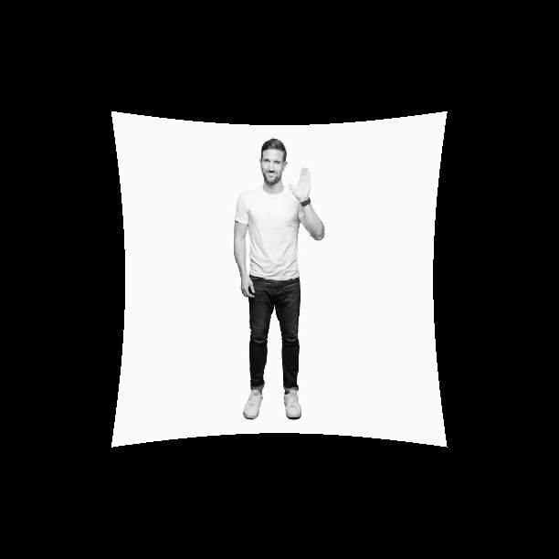

# Репроектор

В рамках задачи необходимо было написать программу, которая перепроецирует исходное изображение с одной камеры на другую камеры. 

## Внутренние параметры камеры
1. _fx_ - фокусное расстояние по оси X
2. _fy_ - фокусное расстояние по оси Y
3. _cx_ - оптический центр камеры по оси X
4. _cy_ - оптический центр камеры по оси Y
5. _lambda_ - коэффициент радиальной дисторсии

## Описание решения
Для решения задачи аналитически вывел формулы для преобразования из 2D в 3D и обратно. Для получения преобразования из 3D в 2D использовал матричный способ через обратную матрицу и алгебраические дополнения. Полученная формула сошлась с формулой, данной в задании. 

Сначала реализовал решение на python, чтобы убедиться, что все работает (**reprojection.py**). 

В коде решения на С++ реализовал класс _Projector_ с тремя методами _set_parameters()_ _get3DCoordsfrom2D()_ и _get2DCoordsfrom3D()._
<br>_set_parameters()_ используется для инициализации переменных класса. 
<br>_get3DCoordsfrom2D()_ и _get2DCoordsfrom3D()_ для преобразования координат.

В общем виде алгоритм выглядит следующим образом:
1. Чтение изображения.
2. Преобразование координат изображения из 2D в 3D на основе параметров камеры 1. 
3. Преобразование координат изображения из 3D в 2D на основе параметров камеры 2.
4. Сохранение изображения.  

**Входные данные:**
1. **image_path** (required) - путь до изображения.
2. **fx1, fy1** (optional) - фокусные расстояния по осям X и Y камеры 1. Значение по умолчанию 10.
3. **cx1, cy1** (optional) - оптический центр по осям X и Y камеры 1. Возможно передать значение -1, в этом случае оптический центр будет высчитан как половина ширины/высоты изображения. Значение по умолчанию половина ширины/высоты изображения.
4. **lambda1** (optional) - значение радиальной дисторсии. Значение по умолчанию 0.0.
5. **fx2, fy2** (optional) - фокусные расстояния по осям X и Y камеры 1. Значение по умолчанию 5.
6. **cx2, cy2** (optional) - оптический центр по осям X и Y камеры 1. Возможно передать значение -1, в этом случае оптический центр будет высчитан как половина ширины/высоты изображения. Значение по умолчанию половина ширины/высоты изображения.
7. **lambda2** (optional) - значение радиальной дисторсии. Значение по умолчанию 0.0.

Я не стал добавлять во входные параметры тип камеры, потому что это понятно по значению lambda и путь до папки сохранения результирующего изображения т.к. и так много параметров. Вместо этого я сохраняю результирующее изображение в той же папке с префиксом result. 

**Пример запуска скрипта в контейнере:**
```
./projector ../../data/1.jpg fx1 fy1 cx1 cx2 lambda1 fx2 fy2 cx2 cy2 lambda2
./projector ../../data/1.jpg 10 10 -1 -1 0 5 5 -1 -1 0.1
```

## Сборка контейнера и проверка работы
```
git clone https://github.com/denred0/reprojector.git
cd reprojector
docker pull ubuntu:20.04
docker build -t projector .
docker run --name projector_container -it --entrypoint bash projector
cd src
mkdir build && cd build
cmake ..
make

# запускаем репроектор
./projector ../../data/1.jpg 10 10 -1 -1 0 5 5 -1 -1 0.1

# результат сохранился, выходим из контейнера
CTRL+D

# выгружаем контейнер
docker export projector_container > projector_container.tar
mkdir projector_container && tar -xf projector_container.tar -C projector_container

# переходим в папку и смотрим результат в любом просмотрщике изображений
cd projector_container/app/data/
```

**Результат работы:**
```
./projector ../../data/1.jpg 10 10 -1 -1 0 5 5 -1 -1 0.1
```
<br>Исходное изображение:
<br>
<br>Изображение после преобразования:
<br>


## Улучшения и векторизация и тесты
### Тесты
В качестве тестов можно сделать проверку на типы входных данных (чтобы они соответствовали float/int).
Можно сделать тест, когда параметры камеры 1 и камеры 2 совпадают, то на выходе должна получиться такое же изображение как на входе. 
Также можно попробовать сделать обратное преобразование. У opencv есть метод undistort, который восстанавливает изображение после дисторсии, но как это будет работать надо еще проверять. 

### Улучшения
1. Можно добавить тесты.
2. Дописать .h файл и использовать как отдельную библиотеку.
3. Ускорить двойные циклы (векторизация и распараллеливание). 

### Векторизация и распараллеливание
Я не работал раньше с векторизацей и распараллеливанием. Попытался сделать векторизацию двойных циклов с помощью директивы _pragma omp simd_, но замеры времени выполнения показали, что время работы алгоритма никак не изменилось. С векторизацией и распараллеливанием еще предстоит разобраться. 
